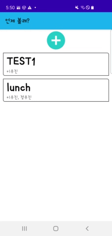
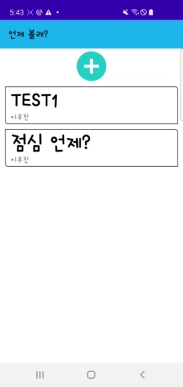

# madcamp_pj2_backend
"언제볼래?" is an android application that helps users to schedule their appointments. This project is motivated by [when2meet](https://www.when2meet.com/).

---
# Project structure
- [frontend](https://github.com/woojin7879/when2meet_frontend) is for android application.
- [backend](https://github.com/woojinnn/madcamp_pj2_backend) is for backend server.

---
## Development Envrionment
- Frontend
    - IDE
        - Android studio
    - Language
        - `Java`
        - `Retrofit2` for HTTP connection
    - Testing device spec:
        - SM-G970N (Samsung Galaxy S10e)
        - Android 11
- Backend
    - Langauge
        - `Node.js`
            - `express` framework
        - `MongoDB`
            - `mongoose` ODM
    - Insomnia for testing HTTP request
    - Testing server spec:
        - Ubuntu 18.04.2 LTS
        - Kernel version:  
            Linux camp-20 4.15.0-166-generic #174-Ubuntu SMP Wed Dec 8 19:07:44 UTC 2021 x86_64 x86_64 x86_64 GNU/Linux

---
## Demo and Explanation
"언제볼래?" is an application for scheduling appointment.  
Here comes some demo videos:  
1. Login via Kakao account  
    

2. Making appointment  
    

3. Enter appointment and Check schedule
    

    
    
    
  
    ** We modified colors darker so that you can distinguish better

4. Exit and Delete appointment  
    

    
    
    

 

---
## Contacts
Contributors
- Woojin, Lee: wjl0209@kaist.ac.kr
    - Building API specification
    - Database management
    - Server management
    - HTTP connection with `Retrofit2`
- Woojin, Jung: woojin7879@unist.ac.kr
    - Kakao SDK login
    - Application development via Android Studio